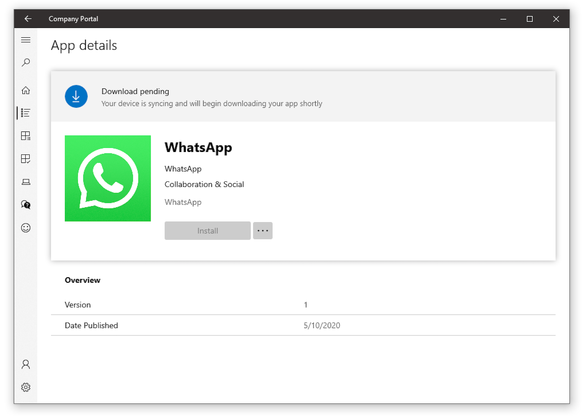

# Creating intunewin for Microsoft Intune
Example and manage Windows Apps (.intunewin) with Intune

### Preperation
* Please take a look and read the Microsoft documentation for [Win32 App Managment](https://docs.microsoft.com/en-us/mem/intune/apps/apps-win32-app-management)
* After reading, download the newest [github](https://github.com/Microsoft/Microsoft-Win32-Content-Prep-Tool) repo for creating Win32 app
* Download an .exe file. I will show here for Whatsapp.exe, [download link](https://www.whatsapp.com/download/).
* Optional: Download the app logo.

### Creating intunewin app
* Start Powershell and clone the Win32 App Managment repo
* Start the application `.\IntuneWinAppUtil.exe` and follow the points:
  * `Please specify the source folder: C:\Users\SalihZengin\Desktop`
  * `Please specify the setup file: WhatsAppSetup.exe`
  * `Please specify the output folder: C:\Users\SalihZengin\Desktop`
  * `Do you want to specify catalog folder (Y/N)? N`
* You will end up with this file `WhatsAppSetup.intunewin`

### Upload and setting in Intune
* Visit your Intune environment, e.g. with [Microsoft Device Management](http://devicemanagement.microsoft.com)
* Visit `Apps` -> `Windows` -> `Add` -> `Windows app (Win32)`
* Install command: `WhatsAppSetup.exe /S` (/S for silent mode, [Docu](https://support.microsoft.com/en-us/help/912203/description-of-the-command-line-switches-that-are-supported-by-a-softw) for install parameters)
* Uninstall command: `...` (Actually you need to install manually the .exe before you can find the diretory and uninstaller. For this case, I couldn't find any uninstaller.exe. respectively, it doesnt exist.
* Operating system architecture: `x64`
* Minimum operating system: `Windows 10 1607`
* Rules format: `Manually configure detection rules`
* Choose `file`, enter e.g.`C:\Users\SalihZengin\AppData\Local\WhatsApp\` as path and `WhatsApp.exe` as `File or holder`. The detection mode is: `File or folder exists`
* Last step: Assign this application to any group. I choosed `Available for enrolled devices` and selected an user group.

After a while the Company Portal will show the app

